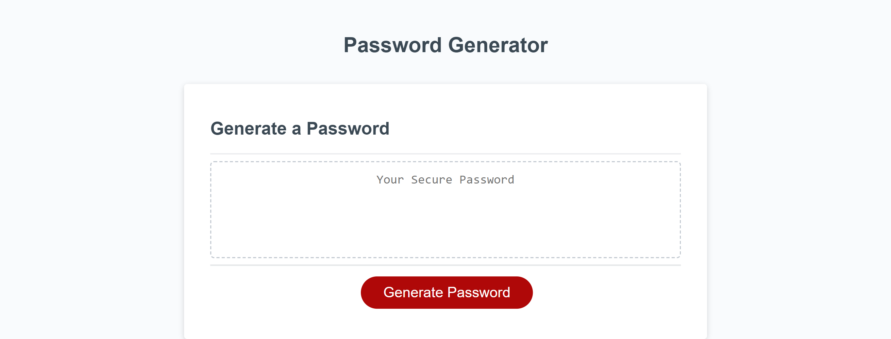

# Password Generator

## Description

This repository is where I created a random password generator using JavaScript.

## Installation

N/A

## Usage

[Deployed website] (https://mmmatson.github.io/password-generator/)

Click the "Generate Password" button, then input your desired password length in the prompt and confirm whether you would like the password to include numbers, special characters, lowercase letters, and/or uppercase letters.

## Credits

[Repository with starter code] (https://nu.bootcampcontent.com/NU-Coding-Bootcamp/NU-VIRT-FSF-PT-09-2022-U-LOLC/-/tree/main/)

## License

MIT License. See repository for license information.
